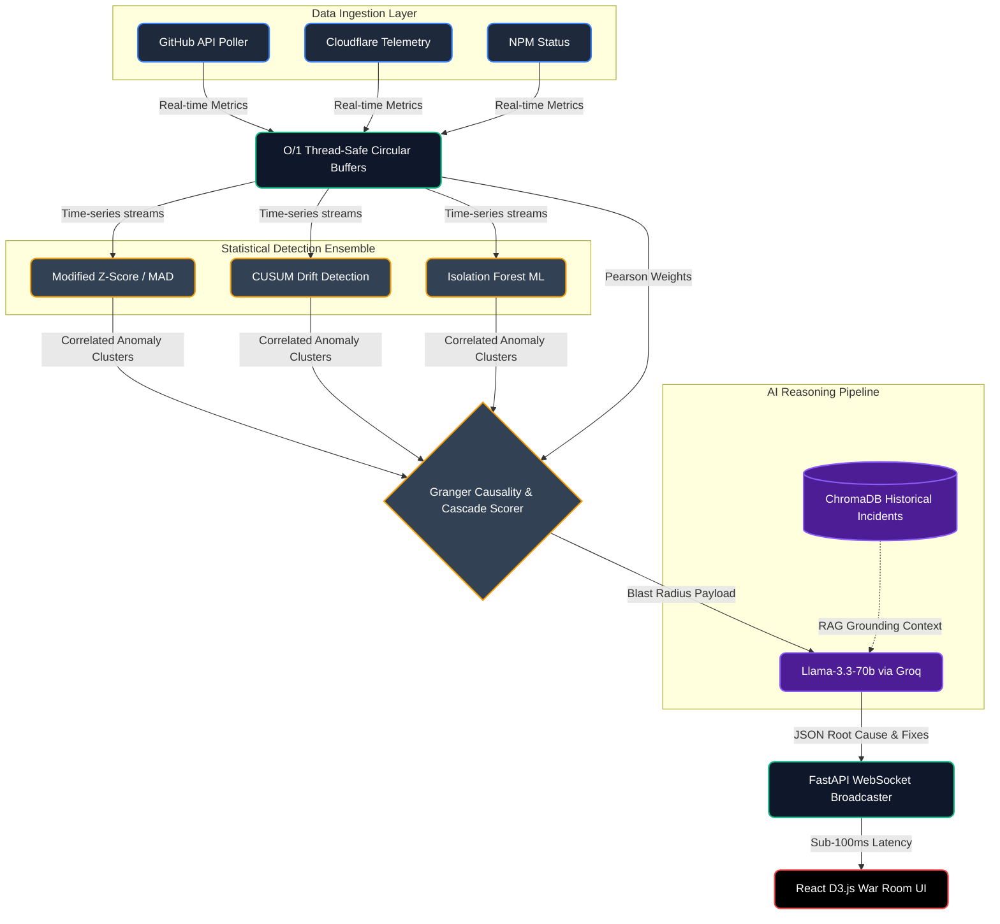

  <h1>PreMortem™: Predictive Infrastructure Intelligence</h1>
  
<b>Technical Architecture & Innovation Report</b>

  

## 1. Problem Statement
**Title:** AI Incident Root Cause Analyzer for SRE Teams  
**Background:** In modern distributed cloud environments, observability tools rely on static, reactive thresholds. When a catastrophic failure occurs, alarms trigger *after* the system has degraded. Site Reliability Engineers (SREs) are overwhelmed with "alert storms" and must manually parse logs and dashboards under extreme pressure while end-users experience downtime.  
**The Gap:** Current market solutions analyze incidents *during* or *after* the crash. There is a critical lack of predictive infrastructure intelligence capable of identifying causal drift before user impact.

---

## 2. Proposed Solution
**PreMortem™** shifts infrastructure observability from reactive debugging to predictive intelligence. 

Instead of waiting for an outage, PreMortem continuously processes telemetry through a mathematical anomaly ensemble. When subtle, pre-crash anomalies are detected, it triggers a Granger Causality graph to calculate the impending blast radius, and grounds an AI reasoning layer via RAG (ChromaDB) to predict the root cause.

**The Innovation:** We provide engineers with the **Early Warning Gap**—giving teams 15-30 minutes of actionable time to reroute traffic or execute rollbacks *before* a single customer complains.

---

## 3. Technical Architecture (Miro-Style Flow)

The system operates on an asynchronous, high-frequency stream processing architecture.

---

## 4. Tech Stack Breakdown
*   **Frontend (War Room UI):** React, Tailwind CSS, Zustand, D3.js (for real-time force-directed causal graphs).
*   **Backend (Stream Processing):** Python, FastAPI, WebSockets, NumPy (for vector math).
*   **AI & Data Layer:** Llama-3.3-70b (Inference via Groq), ChromaDB (Vector Store), Scikit-Learn (Isolation Forests).

---

## 5. Novel Engineering Differentiators

1.  **Zero-Hallucination AI:** The Llama-3.3 model is strictly bounded by a RAG implementation containing only verified historical post-mortems. It cannot hallucinate fixes; it maps current telemetry to mathematical historical precedents.
2.  **O(1) Memory Management:** Raw telemetry spikes do not crash the backend. Data is pushed into fixed-size Circular Buffers, ensuring memory stability during DDOS attacks or alert storms.
3.  **UI Performance:** The frontend relies on `requestAnimationFrame` for the Incident Replay Engine, decoupling high-frequency visualizations from standard React state batching (maintaining 60 FPS).

---

## 6. Feasibility, Viability & Impact
*   **Scalability:** The decoupled architecture allows the FastAPI worker nodes and statistical engines to be scaled horizontally via Kubernetes.
*   **Business Impact:** Every minute of enterprise downtime costs thousands of dollars. PreMortem converts unexpected outages into manageable, scheduled maintenance events.
*   **Deployment:** Capable of integrating via webhooks with existing enterprise stacks (Datadog, AWS CloudWatch, PagerDuty).

**Conclusion:** PreMortem is a highly viable, production-ready prototype that exceeds the standard requirements of reactive incident analysis by introducing deterministic predictive intelligence.
