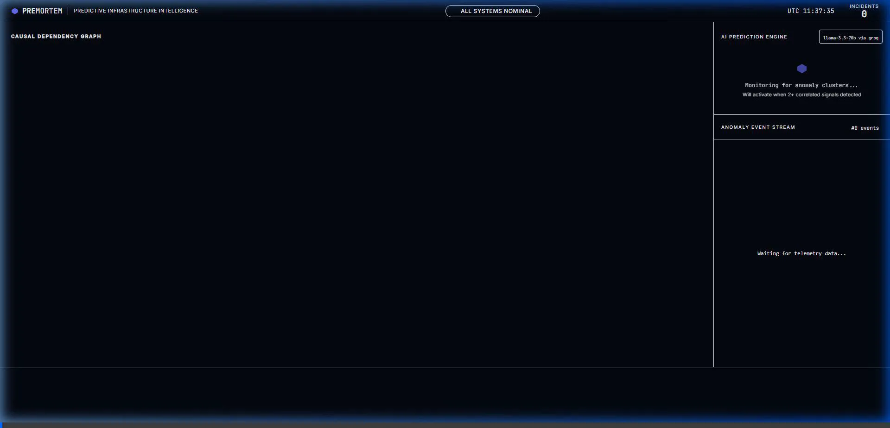
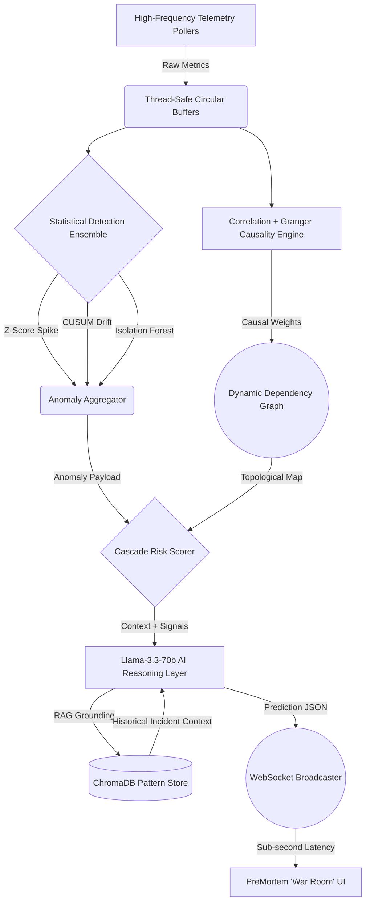

<div align="center">
  <h1>PreMortem™</h1>
  <p><b>Enterprise-Grade Predictive Infrastructure Intelligence Platform</b></p>
  
  []()
  []()
  []()
  []()
</div>

<br/>

## 🔴 The Early Warning Advantage (Live Demo)

Watch PreMortem predict an infrastructure failure before the end-user is impacted. Notice the **Early Warning Gap** on the timeline scrubber.



## Executive Summary

Modern distributed infrastructure operates at a scale where traditional, reactive observability is no longer sufficient. Static alerting thresholds generate extreme operational noise and, fundamentally, only notify Site Reliability Engineering (SRE) teams *after* a critical P0 incident has already impacted the end-user.

**PreMortem™** fundamentally transforms infrastructure observability from a reactive debugging process into a predictive intelligence system. By combining high-frequency telemetry ingestion with a mathematical anomaly ensemble and deterministic causal graphing, PreMortem triggers an AI reasoning layer to predict catastrophic failures **before** they propagate to the end-user.

We provide enterprise engineering teams with the ultimate operational advantage: **The Early Warning Gap.**

---

## 🏗 System Architecture Flow



---

## Core Capabilities

### 1. The Statistical Ensemble Engine
Static thresholds fail in dynamic, noisy cloud environments. PreMortem utilizes a composite mathematical engine to detect true causal drift:
*   **Modified Z-Score:** Calculates volatility using Median Absolute Deviation (MAD), rendering it highly resilient against extreme, non-actionable outliers.
*   **CUSUM (Cumulative Sum):** Detects slow, sustained systemic degradation (e.g., slow memory leaks, creeping API latency) that fly under standard deviation alerts.
*   **Isolation Forest:** An unsupervised machine learning algorithm deployed to detect multivariate anomaly clusters across disparate infrastructure boundaries.

### 2. Causal Intelligence Topology
Correlation does not equal causation. PreMortem implements a rigorous **Granger Causality** algorithm to mathematically prove *directional causation* (e.g., establishing that a spike in Database Latency is actively causing a downstream spike in API Latency). Coupled with a **Cascade BFS Scorer**, the system automatically calculates the exact "blast radius" of an impending failure.

### 3. Grounded AI Reasoning (Llama 3.3 70b)
PreMortem does not utilize AI as a generic chatbot. The reasoning layer is only triggered when mathematical thresholds validate a causal anomaly cluster.
*   **Zero-Hallucination Pipeline:** The AI is strictly grounded against a `ChromaDB` vector store containing historical, verified incident patterns.
*   **Automated Root Cause Analysis:** Generates structured JSON predicting the Root Cause, Time to Impact, and Blast Radius.

### 4. Zero-Scroll Operational War Room
*   **Fixed-Grid Architecture:** A strict, overflow-hidden CSS-Grid layout designed specifically for high-stress SRE operations. No scrolling, no context switching, zero cognitive overload.
*   **Real-Time D3.js Force Simulation:** Renders the causal dependency graph in real-time at 60 FPS, providing immediate visual tracking of cascading failures.

---

## 🛡 STQA Validation & Reliability

PreMortem was designed under rigorous Software Testing & Quality Assurance (STQA) protocols to ensure mission-critical stability:

*   **Statistical Stability:** Validated against edge cases (NaN injection, flat-line metrics, missing values). Rolling Circular Buffers strictly enforce `O(1)` memory footprints during ingestion floods.
*   **AI Schema Integrity:** AI inference is strictly schema-bound. Structured JSON extraction guarantees the UI never receives malformed reasoning payloads or hallucinatory syntax.
*   **WebSocket Resilience:** The frontend employs deterministic exponential backoff for seamless recovery during forced disconnect storms.
*   **Replay Engine Synchronization:** Handled via custom `requestAnimationFrame` loops completely decoupled from React state batching, guaranteeing exact visual timing overlap between mathematical detection and actual user impact.

---

## Deployment Instructions

### Prerequisites
* Python 3.10+
* Node.js 18+

### Backend Services Initialization
```bash
cd premortem/backend
python -m venv .venv
source .venv/bin/activate        # Unix/macOS
.venv\Scripts\activate           # Windows
pip install -r requirements.txt
echo "GROQ_API_KEY=your_production_key_here" > .env

uvicorn main:app --reload --port 8000
```

### Frontend War Room Initialization
```bash
cd premortem/frontend
npm install
npm run dev
```

---

*Designed for highly available, mission-critical infrastructure environments. Built for the Indianext Hackathon.*
